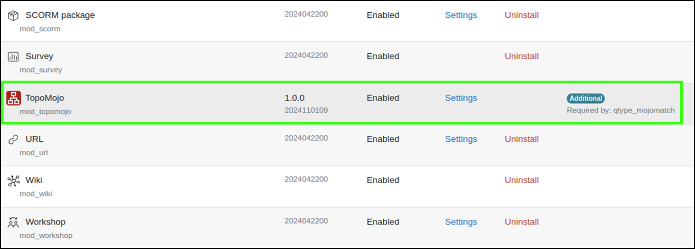

# TopoMojo Plugin for Moodle

## Table of Contents

1. [Description](#description)
2. [Features](#features)
3. [Requirements](#requirements)
4. [Installation](#installation)
5. [Configuration](#configuration)
6. [Usage](#usage)
7. [License](#license)

## Description

The **TopoMojo Plugin for Moodle** is an activity plugin that integrates TopoMojo labs and exercises into the Moodle Learning Management System (LMS). It enables users to access virtual labs, view Markdown content, and complete challenge questions directly from within Moodle.

>This documentation is meant for Moodle system administrators.

## Features

- Embed and/or link TopoMojo labs into Moodle activities.
- Import challenge questions from TopoMojo and manage in Moodle's quiz and grading systems.
- Configure lab access, grading methods, attempts, and durations.
- Import and map TopoMojo workspace tags for better organization within Moodle.

## Requirements

1. Moodle 4.x or above.
2. TopoMojo deployed and operational.
3. [TopoMojo Question Type plugin](https://github.com/cmu-sei/moodle-qtype_mojomatch) installed.
4. [TopoMojo Question Behavior plugin](https://github.com/cmu-sei/moodle-qbehaviour_mojomatch) installed.

## Installation

System admin-type users or users who have the appropriate permissions should follow the procedures below to download and install the TopoMojo for Moodle plugin.

1. Download the plugin from this repo.
2. Extract the plugin into the `mod/topomojo` directory of your Moodle instance.
3. Log into your Moodle as a site administrator or with the appropriate permissions.
4. Navigate to **Site administration**, **Plugins**, **Install plugins**.
5. Upload the plugin zip file (for example, **Admin Moodle TopoMojo Plugin.zip**) and click **Upload this file**.
6. Click **Install plugin from the ZIP file**.
7. Follow the prompts to complete the installation process.

### Verifying your installation

1. Navigate to **Site administration**, **Plugins**, **Manage Activities**.
2. Confirm that the TopoMojo plugin appears in the list of installed activities.
3. Verify that the required *mojomatch* plugins (Question Type and Question Behavior) are also installed.

## Configuration

Access configurable global settings in Moodle by navigating to **Site Administration**, **Plugins**,  **TopoMojo**. Following is an explanation of the settings.

#### General Settings

**Enable Oauth2 System Account:** Enables the use of the Oauth2 system account for integration with Topomojo. This will remove the requirement of apikeys.

**Issuer Id:** Oauth2 Issuer ID for Applications. Select the desired issuer to be used from the dropdown.

**Display Mode:** Determines how labs will be displayed in Moodle.

- *Embed Lab inside Moodle:* The lab will appear embedded within a Moodle activity page. This is the default.
- *Display Link to TopoMojo:* A link to open the lab in a new tab or window i provided.

**Workspace Selection Method:** Configures how administrators or teachers select workspaces when setting up a TopoMojo activity.

- *Dropdown:* Displays a simple dropdown menu of workspaces.
- *Searchable:* Enables a search box for quickly finding workspaces. This is the default.
- *Manual:* Requires manual entry of a workspace ID.

**Filter Workspaces:** Enables filtering of available workspaces based on audience tags. The default is **No**. When enabled, an additional option, the  **Audience Filter** becomes available.

**Audience Filter:** Enter the tag or audience criteria for filtering workspaces.

#### API Integration

By default, all of these fields are empty and should be completed during the setup process.

**TopoMojo API Base URL:** The API endpoint URL for the TopoMojo server (e.g., `https://topomojo.example.com/api`).

**TopoMojo Base URL:** The base URL of the TopoMojo server used for linking and embedding (e.g., `https://topomojo.example.com`).

**Enable External API Key:** If the use of the Oauth2 system account is not desired, check this option to enable the use of an API key.

**API Key:** The authentication key required for secure communication between Moodle and TopoMojo. This key is issued by the TopoMojo administrator.

**Enable External Manager User:** If the use of the Oauth2 system account is not desired, check this option to set the manager name that holds the API key set.

**Manager Name:** Specifies the manager name used for identifying the TopoMojo API integration instance.

#### Limits and Constraints

**Maximum Challenge Submissions:** The maximum number of times a student can submit answers for a single challenge in a lab. Set `0` for unlimited submissions. The default is `10`.

**Maximum Active Labs:** Limits the number of active labs a student can have at one time. Set `0` for unlimited active labs. The default is `2`.

#### Tag Management

**Import Tags:** Enables the import of tags from TopoMojo workspaces. The default is **No**.

**Create Tags:** Automatically creates Moodle tags from imported TopoMojo workspace tags. The default is **No**.

**Tag Collection:** Allows administrators to assign imported tags to a specific Moodle tag collection for organization. The default is **Default Moodle tag collection**.

**Map Tags:** Enables mapping of imported tags for better alignment with Moodle's tagging systems. The default is **No**.

## Usage

### Adding a TopoMojo Activity

Follow the procedures below to add a TopoMojo activity to a course in Moodle.

1. Navigate to your desired course and click **Add an activity or resource**.
2. Select TopoMojo from the activity/resource list.
3. Under **General**, complete the following.
   - **Description:** Provide a description of the activity, visible to students if enabled. 
   - **TopoMojo Workspace:** Use the dropdown or search field to select a TopoMojo workspace. Workspaces can be filtered by audience or tags depending on the plugin configuration.
   - **Variant:** Specify a variant of the lab (i.e., version).

4. Under **Appearance**, complete the following:
   - **Display Mode:** Either embed labs within Moodle or link externally to the TopoMojo application. 
   - **Clock:** Set how the timing information is displayed.
     - **Hidden:** No timing information is displayed.
     - **Countdown:** Displays a countdown timer.
     - **Timer:** Displays elapsed time.

5. Under **Grade**, complete the following:
   - **Grade:** Set the maximum grade for the activity.
   - **Grading method:** First attempt, Last completed attempt, Average of all attempts, Highest attempt.

6. Finally, under **Timing**, specify the following:
   - **Open the activity**/**Close the activity:** These are your start/end dates.
   - **Duration:** The total time permitted to complete the lab in minutes.
   - **Extend Lab:** Check to allow the lab time to extend if needed (requires **Countdown** as the Clock value).

### Launching a TopoMojo Activity

Follow the procedures below to launch and complete a lab using the TopoMojo for Moodle plugin.

1. In Moodle, locate the course that contains the TopoMojo activity.
2. In the course, select a TopoMojo activity (denoted by the TopoMojo icon). See the screen print below.
3. Read the preview of the lab instructions and click **Launch Lab**. This deploys the lab on TopoMojo.
4. Read the full lab instructions and attempt to complete the lab. Most likely, after reading the instructions, your first step will be to launch one of the provided virtual machines (e.g., kali) and start your work.

**Timer:** Displays a countdown until the lab expires.

**Extend Lab:** If enabled by a Moodle admin, permits the user to extend the time to complete the lab.

**End Lab:** Destroys the lab in TopoMojo.

**Generate Invite:** Creates an invitation link for others to join the deployed lab. Give the link to a colleague or friend who can join and help.

**Challenge tab:** Contains the questions that must be answered to complete the activity.

**Review Activity Attempts:** Tracks the user's performance history.

## License

TopoMojo Plugin for Moodle

Copyright 2024 Carnegie Mellon University.

NO WARRANTY. THIS CARNEGIE MELLON UNIVERSITY AND SOFTWARE ENGINEERING INSTITUTE MATERIAL IS FURNISHED ON AN "AS-IS" BASIS.
CARNEGIE MELLON UNIVERSITY MAKES NO WARRANTIES OF ANY KIND, EITHER EXPRESSED OR IMPLIED, AS TO ANY MATTER INCLUDING, BUT NOT LIMITED TO,
WARRANTY OF FITNESS FOR PURPOSE OR MERCHANTABILITY, EXCLUSIVITY, OR RESULTS OBTAINED FROM USE OF THE MATERIAL.
CARNEGIE MELLON UNIVERSITY DOES NOT MAKE ANY WARRANTY OF ANY KIND WITH RESPECT TO FREEDOM FROM PATENT, TRADEMARK, OR COPYRIGHT INFRINGEMENT.
Licensed under a GNU GENERAL PUBLIC LICENSE - Version 3, 29 June 2007-style license, please see license.txt or contact permission@sei.cmu.edu for full
terms.

[DISTRIBUTION STATEMENT A] This material has been approved for public release and unlimited distribution.
Please see Copyright notice for non-US Government use and distribution.

This Software includes and/or makes use of Third-Party Software each subject to its own license.

DM24-1175
